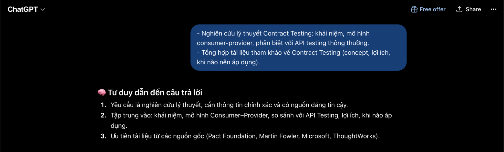

ChatGPT. Free Model, OpenAI, chat.openai.com, accessed 16:10 on Jun 30, 2026, prompt:  
“- Nghiên cứu lý thuyết Contract Testing: khái niệm, mô hình consumer-provider, phân biệt với API testing thông thường.  
\- Tổng hợp tài liệu tham khảo về Contract Testing (concept, lợi ích, khi nào nên áp dụng).”, used to complete the personal task; AI generated content, student revised and validated using web search research results.

