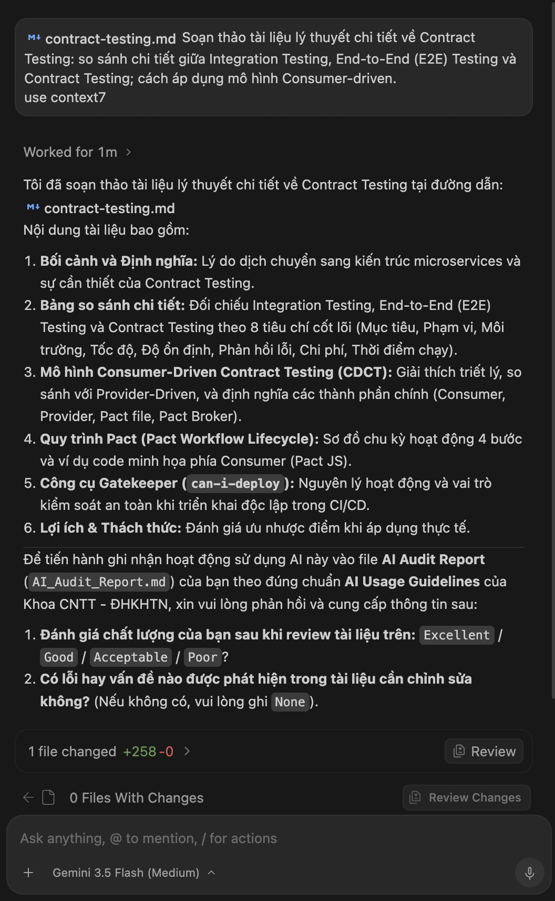

Soạn thảo tài liệu lý thuyết chi tiết về Contract Testing: so sánh chi tiết giữa Integration Testing, End-to-End (E2E) Testing và Contract Testing; cách áp dụng mô hình Consumer-driven.
use context7

