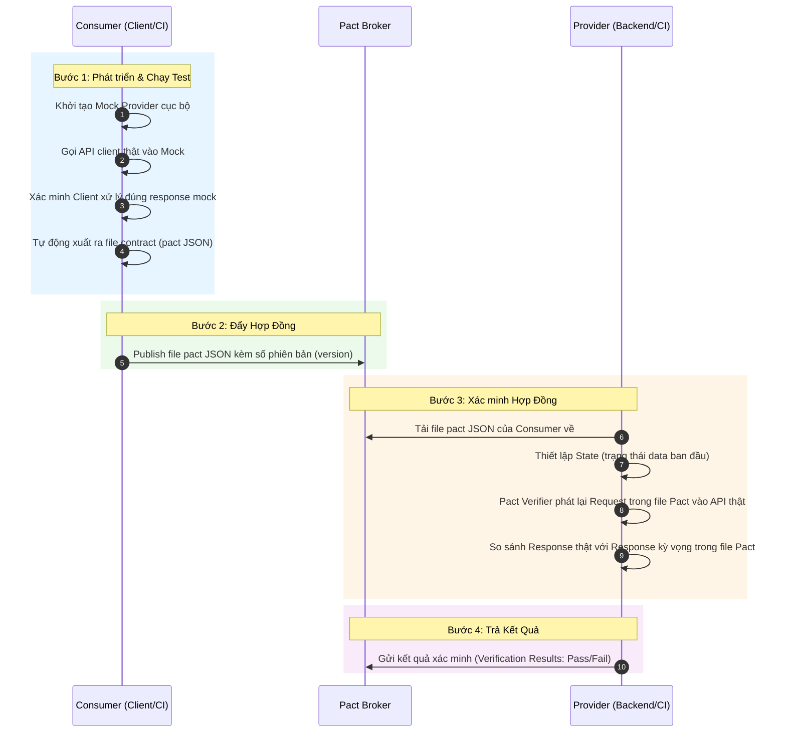

# Tài liệu Lý thuyết Chuyên sâu: Contract Testing và Mô hình Consumer-Driven

Tài liệu này cung cấp một cái nhìn toàn diện, sâu sắc và chi tiết về **Contract Testing (Kiểm thử hợp đồng)**. Nội dung bao gồm sự so sánh chi tiết giữa ba phương pháp kiểm thử tích hợp phổ biến hiện nay và hướng dẫn chi tiết cách áp dụng mô hình **Consumer-Driven Contract Testing** trong môi trường phát triển microservices thực tế.

---

## 1. Bối cảnh và Định nghĩa tổng quan

Trong kiến trúc **Monolithic (Đơn khối)** truyền thống, toàn bộ ứng dụng chạy trên một tiến trình duy nhất. Việc kiểm thử tích hợp tương đối trực quan vì các thành phần chia sẻ chung bộ nhớ hoặc gọi trực tiếp mã nguồn của nhau.

Tuy nhiên, với sự dịch chuyển mạnh mẽ sang kiến trúc **Microservices (Vi dịch vụ)** hoặc hệ thống phân tán, các dịch vụ giao tiếp với nhau qua mạng (thường là HTTP REST API, GraphQL, hoặc Message Queue). Mỗi dịch vụ được phát triển, sở hữu và triển khai độc lập bởi các đội ngũ khác nhau. Điều này đặt ra một thách thức lớn: **Làm sao để đảm bảo các dịch vụ có thể giao tiếp chính xác với nhau mà không làm hỏng hệ thống khi triển khai độc lập?**

**Contract Testing (Kiểm thử hợp đồng)** ra đời để giải quyết bài toán này. Đây là một phương pháp kiểm thử tập trung vào việc xác minh xem các dịch vụ giao tiếp có tuân thủ đúng một **"hợp đồng" (contract)** đã thỏa thuận chung hay không. Hợp đồng này quy định cấu trúc dữ liệu gửi và nhận giữa các dịch vụ (Request/Response), bao gồm các trường thông tin, kiểu dữ liệu, HTTP status codes, header và các ràng buộc logic biên.

---

## 2. So sánh chi tiết: Integration Testing, End-to-End (E2E) Testing và Contract Testing

Để hiểu rõ tại sao Contract Testing lại trở thành một mảnh ghép không thể thiếu trong quy trình CI/CD hiện đại, chúng ta hãy so sánh chi tiết phương pháp này với hai phương pháp kiểm thử truyền thống là **Integration Testing** và **End-to-End (E2E) Testing**.

### Bảng so sánh chi tiết các tiêu chí kiểm thử

| Tiêu chí | Integration Testing (Kiểm thử tích hợp) | End-to-End Testing (Kiểm thử toàn diện) | Contract Testing (Kiểm thử hợp đồng) |
| :--- | :--- | :--- | :--- |
| **Mục tiêu chính** | Xác minh sự tương tác logic và dòng chảy dữ liệu giữa một số module hoặc dịch vụ được kết nối trực tiếp. | Xác minh toàn bộ hành trình người dùng (User Journey) hoạt động chính xác từ đầu đến cuối trên một hệ thống hoàn chỉnh. | Xác minh tính tương thích và tính toàn vẹn của giao tiếp API giữa bên tiêu thụ (Consumer) và bên cung cấp (Provider) theo giao ước. |
| **Phạm vi kiểm thử** | Tích hợp nhóm nhỏ (từ 2 đến vài dịch vụ). Thường mock các hệ thống bên ngoài nhóm này. | Toàn bộ hệ thống từ Front-end, API Gateway, các Microservices, Databases cho tới dịch vụ bên thứ ba (Third-party). | Từng cặp dịch vụ cô lập (1 Consumer - 1 Provider). Không tích hợp hệ thống thực tại thời điểm kiểm thử. |
| **Môi trường yêu cầu** | Môi trường Dev/Staging bán tích hợp. Cần khởi chạy một vài dịch vụ phụ thuộc thực tế. | Môi trường Staging/Pre-production hoàn chỉnh, cấu hình mạng, DNS, cơ sở dữ liệu giống Production nhất có thể. | Môi trường Unit Test (Local hoặc CI pipeline cực kỳ đơn giản). Chạy cô lập thông qua Mock Services. |
| **Tốc độ thực thi** | Trung bình (từ vài phút đến vài chục phút). | Rất chậm (từ vài chục phút đến vài giờ) do phải chờ khởi động hệ thống, dựng dữ liệu và dựng giao diện. | Rất nhanh (chỉ vài giây đến vài phút), tương đương tốc độ của Unit Test thông thường. |
| **Độ ổn định (Reliability)** | Trung bình. Vẫn có thể bị ảnh hưởng bởi sự thay đổi dữ liệu hoặc trạng thái của các dịch vụ khác. | Thấp (Dễ bị **Flaky Tests** - kiểm thử thất bại do lỗi đường truyền mạng, timeout, hoặc dịch vụ thứ ba không phản hồi). | Cực kỳ cao (Deterministic). Không bị ảnh hưởng bởi mạng hay trạng thái ngoài vì dữ liệu đã được mock và đóng gói trong hợp đồng. |
| **Phản hồi lỗi (Feedback)** | Chỉ ra lỗi nằm ở nhóm dịch vụ đang tích hợp, nhưng cần phân tích sâu log để tìm nguyên nhân. | Chậm và khó định vị lỗi. Lỗi xảy ra có thể do Front-end gãy, Backend crash, Database timeout, hay cấu hình mạng sai. | Tức thì và chính xác tuyệt đối. Chỉ ra chính xác trường dữ liệu nào bị thiếu, sai kiểu dữ liệu (data type mismatch) tại dòng code cụ thể. |
| **Chi phí vận hành** | Trung bình. Cần duy trì các kịch bản mock tích hợp và cấu hình dịch vụ trung gian. | Rất cao. Đòi hỏi nhân sự duy trì môi trường, xử lý dữ liệu test bị nhiễm bẩn (data pollution), viết script UI phức tạp. | Thấp. Hợp đồng được tự động sinh ra từ code test của Consumer và tự động xác minh ở Provider thông qua các công cụ hỗ trợ. |
| **Thời điểm chạy** | Chạy sau khi các dịch vụ đơn lẻ đã được build xong trên môi trường Dev. | Chạy cuối cùng trong luồng release (sau khi tất cả dịch vụ đã deploy thành công lên môi trường Staging). | Chạy ngay lập tức ở bước chạy thử nghiệm cục bộ (Local) hoặc ở bước kiểm tra Pull Request trên CI. |

---

## 3. Mô hình Consumer-Driven Contract Testing (CDCT)

### 3.1. Định nghĩa và Triết lý cốt lõi
Trong kiểm thử hợp đồng, có hai cách tiếp cận chính: **Provider-Driven** (Bên cung cấp định nghĩa hợp đồng) và **Consumer-Driven** (Bên tiêu thụ định nghĩa hợp đồng). 

**Consumer-Driven Contract Testing (CDCT)** đặt **Consumer (bên tiêu thụ dịch vụ)** làm trọng tâm để định nghĩa ra hợp đồng. 
* *Triết lý:* Một Provider (ví dụ: Backend REST API) được xây dựng ra chỉ nhằm mục đích phục vụ các Consumer (ví dụ: Web App, Mobile App, API Gateway). Do đó, chính Consumer mới là bên hiểu rõ nhất họ cần những trường dữ liệu nào, định dạng ra sao từ Provider để hiển thị lên giao diện hoặc xử lý logic.
* *Cách hoạt động:* Consumer sẽ chủ động viết mã kiểm thử để định nghĩa ra những yêu cầu (Request) họ sẽ gửi đi và những phản hồi (Response) tối thiểu mà họ mong muốn nhận về. Tập hợp các kỳ vọng này được đóng gói lại thành một **"Hợp đồng" (Contract/Pact file)**. Provider có trách nhiệm phải chạy kiểm thử để chứng minh rằng mình đáp ứng đầy đủ tất cả các yêu cầu trong hợp đồng đó.

```
┌──────────────────┐       Tạo Hợp Đồng (Pact JSON)       ┌──────────────────┐
│    Consumer      │ ───────────────────────────────────> │     Provider     │
│ (Frontend/Client)│  (Kỳ vọng cấu trúc Request/Response) │  (Backend/Server)│
└──────────────────┘                                      └──────────────────┘
         ▲                                                         │
         │                                                         │
         └─────────────────── Xác minh đáp ứng ────────────────────┘
```

### 3.2. So sánh Consumer-Driven với Provider-Driven

* **Provider-Driven Contract Testing:** Provider tự định nghĩa hợp đồng (ví dụ: xuất file OpenAPI/Swagger) rồi ép các Consumer tuân theo.
  * *Nhược điểm:* Provider không biết Consumer nào đang dùng trường thông tin nào. Khi Provider muốn xóa hoặc đổi tên một trường dữ liệu (ví dụ: từ `first_name` sang `firstName`), họ không dám thực hiện vì sợ làm gãy các ứng dụng client phía dưới. Kết quả là API trở nên cồng kềnh với hàng tá trường dữ liệu cũ không ai dám xóa.
* **Consumer-Driven Contract Testing (CDCT):** Mỗi Consumer chỉ định nghĩa đúng các trường dữ liệu mà họ thực sự sử dụng.
  * *Ưu điểm:* Provider biết chính xác trường nào đang có người dùng (qua các hợp đồng đang hoạt động). Nếu một trường dữ liệu không có bất kỳ Consumer nào kỳ vọng trong hợp đồng, Provider có thể tự tin xóa bỏ trường đó mà không sợ ảnh hưởng đến hệ thống. Điều này giúp API luôn tinh gọn và hỗ trợ quá trình **API Evolution** một cách an toàn.

### 3.3. Các thành phần cốt lõi trong hệ sinh thái Pact

Pact là framework phổ biến nhất hiện nay hiện thực hóa mô hình Consumer-Driven Contract Testing. Hệ sinh thái Pact gồm các thành phần:

1. **Consumer (Bên tiêu thụ):** Mã nguồn của ứng dụng client thực hiện các lệnh gọi API.
2. **Provider (Bên cung cấp):** Mã nguồn backend API xử lý và trả về dữ liệu.
3. **Pact file (Tệp hợp đồng):** Tệp tin định dạng JSON được sinh ra tự động bởi Pact ở phía Consumer. Nó ghi lại toàn bộ các tương tác (interactions) bao gồm:
   * **State (Trạng thái của Provider):** Ví dụ: `"User 123 exists"`, `"User database is empty"`.
   * **Request:** Method, Path, Headers, Query parameters, Body gửi đi.
   * **Response:** Status code, Headers, Body mong đợi nhận về.
4. **Pact Broker (Trọng tài/Trung tâm quản lý):** Một ứng dụng web trung gian đóng vai trò lưu trữ các file Pact, quản lý phiên bản của Consumer/Provider, hiển thị ma trận tương thích (Compatibility Matrix) và trả về kết quả xác minh.

---

## 4. Quy trình hoạt động 4 bước chi tiết của Pact (Pact Workflow Lifecycle)

Quy trình áp dụng Consumer-Driven Contract Testing với Pact được chia làm 4 bước tuần tự như sau:



### Chi tiết từng bước thực thi:

#### Bước 1: Thiết lập và tạo hợp đồng ở phía Consumer
Ở phía Consumer, nhà phát triển viết các đoạn mã kiểm thử hợp đồng. Quy trình chạy như sau:
1. **Mock Service:** Pact khởi tạo một máy chủ giả lập (Mock Provider) chạy ở localhost trên một cổng ngẫu nhiên.
2. **Đăng ký Kỳ vọng (Interactions):** Đoạn test định nghĩa: *"Nếu tôi gửi `GET /users/123`, tôi kỳ vọng Mock Service trả về HTTP Status `200` và body là `{ "id": "123", "name": "Alice" }`."*
3. **Thực thi:** Client API thật trong code của Consumer sẽ gọi trực tiếp vào Mock Service này. Đoạn test xác minh xem ứng dụng Consumer có parse dữ liệu trả về và xử lý logic đúng như mong đợi hay không.
4. **Sinh File Pact:** Khi tất cả các bài test ở phía Consumer vượt qua (pass), Pact sẽ tự động biên dịch toàn bộ các kỳ vọng đã đăng ký thành một file JSON duy nhất (ví dụ: `frontend-backend_service.json`).

*Đoạn mã ví dụ phía Consumer (Node.js - Pact JS):*
```javascript
const { PactV3 } = require('@pact-foundation/pact');
const provider = new PactV3({ consumer: 'FrontendApp', provider: 'UserService' });

describe('GET /users/:id', () => {
  it('trả về thông tin chi tiết của người dùng', async () => {
    // 1. Đăng ký tương tác kỳ vọng với Mock Service
    provider.addInteraction({
      states: [{ description: 'user with ID 123 exists' }],
      uponReceiving: 'yêu cầu lấy thông tin user 123',
      withRequest: {
        method: 'GET',
        path: '/users/123',
      },
      willRespondWith: {
        status: 200,
        headers: { 'Content-Type': 'application/json' },
        body: {
          id: '123',
          name: 'Alice',
          email: 'alice@example.com'
        },
      },
    });

    // 2. Chạy test code client thật gọi vào mock server của Pact
    await provider.executeTest(async (mockServer) => {
      const client = new UserApiClient(mockServer.url);
      const user = await client.getUserById('123');
      
      expect(user.name).toEqual('Alice');
      expect(user.email).toEqual('alice@example.com');
    });
  });
});
```

#### Bước 2: Phát hành hợp đồng lên Pact Broker
Sau khi file Pact JSON được tạo thành công trên môi trường cục bộ hoặc CI pipeline của Consumer, nó sẽ được đẩy lên **Pact Broker** thông qua HTTP POST hoặc Pact CLI. 

Lệnh đẩy hợp đồng phổ biến trong script CI:
```bash
pact-broker publish ./pacts \
  --broker-base-url https://your-broker.pactflow.io \
  --broker-token YOUR_BROKER_TOKEN \
  --consumer-app-version $GIT_COMMIT \
  --branch $GIT_BRANCH
```

#### Bước 3: Xác minh hợp đồng ở phía Provider
Phía Provider sẽ thiết lập một bài kiểm thử hợp đồng tự động. Bài test này không gọi trực tiếp cơ sở dữ liệu hay giao diện của Consumer mà hoạt động như sau:
1. **Lấy hợp đồng:** Pact Provider engine tải file Pact của Consumer từ Pact Broker về.
2. **Thiết lập trạng thái (Provider State):** Đối với mỗi tương tác yêu cầu một trạng thái nhất định (ví dụ: `user with ID 123 exists`), Provider test sẽ chạy một đoạn code chuẩn bị dữ liệu (seed data) tương ứng trong hệ thống API của mình (ví dụ: chèn một dòng user id `123` tên `Alice` vào database thử nghiệm).
3. **Phát lại Request:** Pact tự động gửi request `GET /users/123` thẳng vào API Service thật đang chạy ở môi trường test của Provider.
4. **Đối chiếu kết quả:** Pact nhận response trả về từ API thật và đối chiếu với cấu trúc được quy định trong file JSON. Sự đối chiếu này dựa trên các quy tắc so khớp (matching rules):
   * Khớp về cấu trúc và kiểu dữ liệu (ví dụ: trường `id` phải là chuỗi ký tự, không bắt buộc phải khớp chính xác giá trị `"123"` nếu sử dụng matchers).
   * Khớp về mã trạng thái HTTP.
   * Khớp về các headers quan trọng.

#### Bước 4: Trả kết quả xác minh về Pact Broker
Sau khi quá trình so khớp hoàn tất, kết quả xác minh (Thành công hay Thất bại kèm lý do chi tiết) sẽ được gửi ngược lại Pact Broker để lưu trữ. Kết quả này gắn liền với phiên bản cụ thể của cả Consumer và Provider.

---

## 5. Công cụ Gatekeeper: `can-i-deploy` trong CI/CD

Trong kiến trúc vi dịch vụ, mục tiêu tối thượng là **Continuous Delivery** — triển khai độc lập bất kỳ dịch vụ nào lên môi trường Production mà không cần họp bàn hay dựng các buổi triển khai lớn. Để làm được điều này một cách an toàn, Pact cung cấp một công cụ kiểm soát chất lượng cực kỳ mạnh mẽ mang tên **`can-i-deploy`**.

### 5.1. Nguyên lý hoạt động
Trước khi cho phép một phiên bản dịch vụ mới được deploy lên một môi trường (ví dụ: `Production`), pipeline CI/CD của dịch vụ đó sẽ thực hiện truy vấn tới Pact Broker thông qua lệnh `can-i-deploy`.

Pact Broker sẽ kiểm tra ma trận tương thích giữa:
* Phiên bản dịch vụ đang chuẩn bị deploy (được định danh bằng Git Commit Hash).
* Phiên bản của tất cả các dịch vụ liên quan (Consumer hoặc Provider của nó) **đang thực tế chạy trên môi trường đó** (được định danh bằng tags hoặc environments như `prod`).

```
                              ┌────────────────┐
                              │   Pact Broker  │
                              └────────────────┘
                                      ▲
                                      │  1. can-i-deploy?
                                      │  (Kiểm tra xem phiên bản Consumer 2.0.1
                                      │   có tương thích với Provider 1.4.0
                                      │   đang chạy ở Production hay không)
                                      ▼
                             ┌──────────────────┐
                             │    CI Pipeline   │
                             └──────────────────┘
                                      │
                 ┌────────────────────┴────────────────────┐
                 ▼ (Hợp đồng đã xác minh PASS)             ▼ (Hợp đồng FAIL hoặc CHƯA xác minh)
         [ Cho phép deploy ]                       [ Chặn deploy - Báo lỗi đỏ ]
```

### 5.2. Kịch bản thực tế
* **Kịch bản 1: Consumer deploy trước.** Frontend đổi trường yêu cầu từ `name` thành `fullName` trong hợp đồng mới (phiên bản `2.0.0`). Khi chạy `can-i-deploy` lên môi trường `prod`, Broker thấy hợp đồng `2.0.0` này chưa được kiểm chứng thành công bởi phiên bản Provider đang chạy trên `prod`. Lệnh trả về lỗi `Exit Code 1`. Pipeline của Consumer bị dừng lại, ngăn chặn việc deploy giao diện mới lên làm lỗi hiển thị của người dùng.
* **Kịch bản 2: Provider deploy trước.** Backend sửa API và vô tình xóa đi trường `email` mà Frontend đang cần. Khi chạy Provider test, Pact tải hợp đồng từ Broker về, chạy test và phát hiện lỗi thiếu trường dữ liệu kỳ vọng của Consumer. Test fail, kết quả xác minh gửi lên Broker là `Fail`. Khi Provider chạy lệnh `can-i-deploy` để lên `prod`, Broker lập tức từ chối. Lỗi API được giữ lại ở môi trường CI, không thể lên Production.

Cú pháp lệnh thực tế trong CI/CD:
```bash
pact-broker can-i-deploy \
  --pacticipant FrontendApp \
  --version $GIT_COMMIT \
  --to-environment production \
  --broker-base-url https://your-broker.pactflow.io \
  --broker-token YOUR_BROKER_TOKEN
```

---

## 6. Lợi ích và Thách thức khi triển khai Contract Testing

### 6.1. Lợi ích vượt trội
* **Loại bỏ Flaky Tests:** Vì không cần dựng môi trường tích hợp thực tế với mạng, DB và bên thứ ba để kiểm tra API, các bài test contract luôn ổn định và cho ra kết quả giống nhau 100% qua các lần chạy.
* **Phát hiện lỗi cực kỳ sớm (Shift-Left Testing):** Lỗi bất tương thích API được phát hiện ngay trên máy cục bộ của lập trình viên hoặc khi mở Pull Request, thay vì đợi đến khi deploy lên Staging hay chạy test E2E ban đêm.
* **Tự do tái cấu trúc (Refactoring Confidence):** Đội ngũ backend (Provider) có thể tự tin thay đổi cấu trúc code nội bộ, nâng cấp thư viện, đổi database miễn là bộ xác minh Contract Test vẫn chạy thành công.
* **API Documentation "Sống":** Các file Pact chính là tài liệu đặc tả API chuẩn xác nhất vì nó phản ánh trực tiếp hành vi sử dụng thực tế của Client và được cập nhật tự động sau mỗi lần chạy test.

### 6.2. Các thách thức và giới hạn
* **Không kiểm thử logic nghiệp vụ sâu (Business Logic):** Contract testing chỉ kiểm tra xem "đường dẫn và cấu trúc dữ liệu có khớp nhau không", nó không kiểm tra xem logic tính toán bên trong API có đúng hay không. Ví dụ: Nếu API trả về `status: 200` và body đúng cấu trúc nhưng giá trị phép tính tiền là sai, đó là lỗi logic nghiệp vụ và cần được phát hiện bởi Unit Test/Integration Test của chính dịch vụ đó.
* **Chi phí học tập và thay đổi tư duy:** Các thành viên trong nhóm cần hiểu sâu sắc về mô hình Consumer-Driven, cách quản lý state (Provider States) để giả lập dữ liệu chính xác trên Backend.
* **Quản trị hạ tầng:** Cần thiết lập và vận hành Pact Broker ổn định, tích hợp sâu vào quy trình CI/CD của tất cả các đội phát triển.

---

## 7. Kết luận và Khuyến nghị áp dụng

Contract Testing không sinh ra để thay thế hoàn toàn Unit Test hay End-to-End Test. Theo mô hình tháp kiểm thử cải tiến, các tổ chức phát triển nên phân bổ nguồn lực như sau:
1. **Unit Test:** Chiếm tỷ trọng lớn nhất, kiểm thử logic nội bộ dịch vụ.
2. **Contract Test:** Thay thế cho phần lớn các bài test tích hợp API cồng kềnh giữa các dịch vụ nội bộ.
3. **E2E Test:** Rút gọn tối đa, chỉ giữ lại từ 5-10 kịch bản then chốt nhất mô phỏng luồng nghiệp vụ chính của người dùng (ví dụ: Đăng nhập -> Mua hàng -> Thanh toán).

Việc áp dụng mô hình **Consumer-Driven Contract Testing** giúp giải phóng các đội ngũ phát triển khỏi sự phụ thuộc lẫn nhau, tăng tốc độ phân phối phần mềm (Time-to-Market) nhưng vẫn đảm bảo tính an toàn và ổn định tối đa cho hệ thống microservices.
