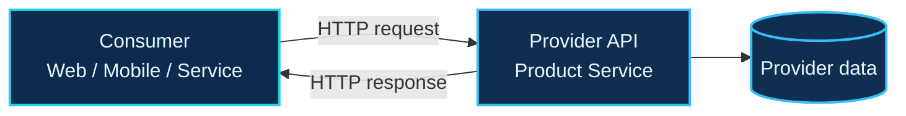
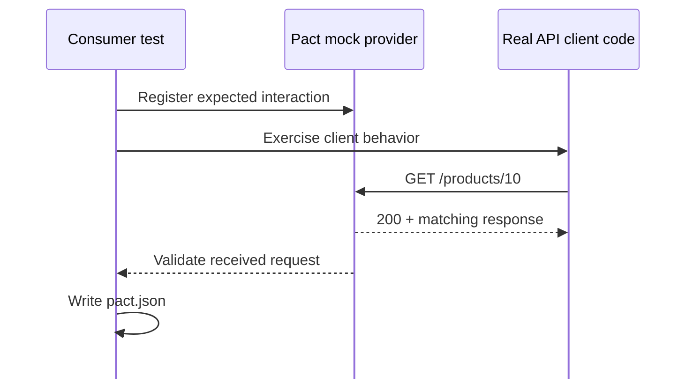
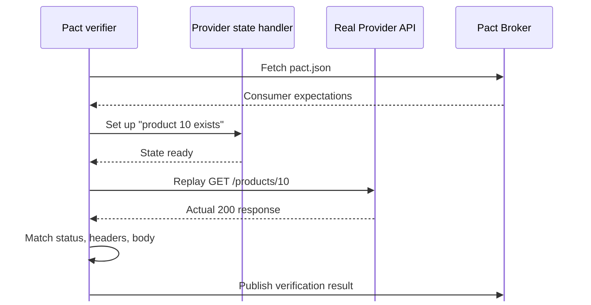
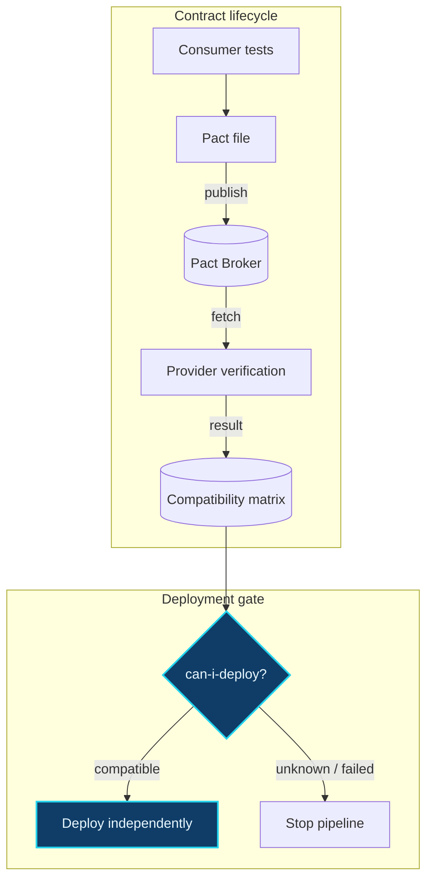

<div class="eyebrow">Software Testing · Group 03 — SEBros</div>

# <span class="accent">Contract Testing</span><br>Consumer ↔ Provider

<div class="glow-line" />

<p class="hero-subtitle">
Kiểm chứng khả năng giao tiếp giữa các dịch vụ — nhanh, cô lập và đủ sớm để bảo vệ CI/CD.
</p>

<div class="mt-10 flex gap-3 text-sm text-slate-300">
  <span class="px-3 py-1 rounded-full border border-cyan-400/30">Consumer-Driven</span>
  <span class="px-3 py-1 rounded-full border border-cyan-400/30">Pact workflow</span>
  <span class="px-3 py-1 rounded-full border border-cyan-400/30">Architecture</span>
</div>

<div class="footer-tag">API & CONTRACT TESTING SEMINAR</div>

<!--
Mở đầu bằng câu hỏi: “Một API vẫn chạy, nhưng client lại hỏng — vì sao?”
Deck này tập trung vào ranh giới giao tiếp giữa Consumer và Provider, không đi sâu vào demo code.
-->

---
transition: slide-left
---

<div class="eyebrow">01 · The integration problem</div>

# Khi mỗi service đều **“xanh”**… hệ thống vẫn có thể **“đỏ”**

<div class="card-grid mt-10">
  <div class="glass-card" v-click>
    <div class="metric">Consumer</div>
    <h3>Giả định sai</h3>
    <p>Client kỳ vọng <code>product.name</code>, nhưng Provider đổi thành <code>displayName</code>.</p>
  </div>
  <div class="glass-card" v-click>
    <div class="metric">Provider</div>
    <h3>Test nội bộ vẫn pass</h3>
    <p>Logic và schema mới đều đúng theo góc nhìn của đội backend.</p>
  </div>
  <div class="glass-card" v-click>
    <div class="metric">Runtime</div>
    <h3>Lỗi chỉ lộ khi tích hợp</h3>
    <p>Phát hiện muộn trên staging hoặc production, nơi feedback đắt đỏ nhất.</p>
  </div>
</div>

<div v-click class="callout mt-8">
  <strong class="text-cyan-300">Khoảng trống cần kiểm thử:</strong>
  “Hai phía có còn hiểu cùng một giao thức hay không?”
</div>

<!--
Nhấn mạnh: unit test của từng service không kiểm chứng giả định xuyên biên giới.
Đây là bài toán tương thích, không nhất thiết là bài toán availability hay business logic.
-->

---
transition: fade
---

<div class="eyebrow">02 · Definition</div>

# Contract Testing kiểm tra **lời hứa giao tiếp**

<div class="grid grid-cols-5 gap-8 mt-8 items-center">
  <div class="col-span-3">
    <blockquote>
      Contract là đặc tả có thể thực thi về những request Consumer gửi và response Provider cam kết đáp ứng.
    </blockquote>

  <v-clicks>

  - **Request:** method, path, query, headers, body
  - **Response:** status, headers, schema và matching rules
  - **Context:** provider state — điều kiện trước của interaction

  </v-clicks>
  </div>

  <div class="col-span-2 glass-card">
    <div class="text-xs text-cyan-300 font-mono mb-3">INTERACTION</div>
    <div class="text-sm leading-7">
      <span class="text-slate-400">Given</span> product 10 exists<br>
      <span class="text-slate-400">When</span> GET /products/10<br>
      <span class="text-slate-400">Then</span> 200 + Product schema
    </div>
  </div>
</div>

<div v-click class="mt-6 text-sm text-slate-300">
  Contract Testing xác minh <span class="text-cyan-300 font-bold">tính tương thích</span> — không chứng minh toàn bộ nghiệp vụ đúng.
</div>

<!--
Phân biệt “contract” với một tài liệu tĩnh. Điểm quan trọng là contract được test tự động ở cả hai phía.
Provider state mô tả trạng thái cần có trước request, ví dụ product 10 tồn tại.
-->

---
transition: slide-up
---

<div class="eyebrow">03 · Scope</div>

# Contract Test nằm ở đâu trong chiến lược kiểm thử?

<table class="comparison-table mt-6">
  <thead>
    <tr><th>Tiêu chí</th><th>Integration</th><th>Contract</th><th>End-to-End</th></tr>
  </thead>
  <tbody>
    <tr v-click><td>Câu hỏi chính</td><td>Các module phối hợp đúng?</td><td>Giao diện có tương thích?</td><td>Hành trình người dùng chạy được?</td></tr>
    <tr v-click><td>Phạm vi</td><td>Một nhóm thành phần</td><td>Một cặp Consumer–Provider</td><td>Toàn hệ thống</td></tr>
    <tr v-click><td>Môi trường</td><td>Bán tích hợp</td><td>Cô lập, local/CI</td><td>Gần production</td></tr>
    <tr v-click><td>Feedback</td><td>Trung bình</td><td class="text-cyan-300 font-bold">Nhanh, định vị rõ</td><td>Chậm, khó khoanh vùng</td></tr>
    <tr v-click><td>Điểm mù</td><td>Phụ thuộc ngoài scope</td><td>Business flow, hạ tầng</td><td>Nhiều nguyên nhân gây flaky</td></tr>
  </tbody>
</table>

<div class="callout mt-5 text-sm" v-click>
  Contract Test <strong>bổ sung</strong> Unit / Integration / E2E — không thay thế tất cả.
</div>

<!--
Không tuyệt đối hóa tốc độ hay độ ổn định. Contract test giảm nhiều phụ thuộc runtime, nhưng bộ test kém thiết kế vẫn có thể brittle.
Thông điệp: dùng đúng lớp test cho đúng loại rủi ro.
-->

---
transition: view-transition
comark: true
---

<div class="eyebrow">04 · Consumer–Provider architecture</div>

# Ai sở hữu **lời hứa** nào?

<div class="grid grid-cols-5 gap-6 items-center mt-5">
  <div class="col-span-4 max-h-[300px]">



  </div>
  <div class="col-span-1 flex justify-center">
    <div class="contract-token">pact.json</div>
  </div>
</div>

<div class="grid grid-cols-2 gap-5 mt-3 text-sm">
  <div v-click class="glass-card !min-h-0"><strong class="text-cyan-300">Consumer</strong> mô tả phần API nó thực sự sử dụng.</div>
  <div v-click class="glass-card !min-h-0"><strong class="text-cyan-300">Provider</strong> chứng minh implementation đáp ứng các interaction đó.</div>
</div>

<!--
Đừng nói Consumer “thiết kế toàn bộ API”. Consumer chỉ phát biểu các nhu cầu thực tế của mình.
Mỗi Consumer có thể tạo một pact riêng với cùng Provider.
-->

---
transition: view-transition
comark: true
---

<div class="eyebrow">05 · Consumer side</div>

# Bước 1 — Consumer **tạo contract**

<div class="grid grid-cols-5 gap-8 items-center mt-4">
  <div class="col-span-1 flex justify-center">
    <div class="contract-token">pact.json</div>
  </div>
  <div class="col-span-4">



  </div>
</div>

<div v-click class="callout mt-2 text-sm">
  Mock Provider không thay thế code của Consumer: test phải gọi <strong>API client thật</strong> của Consumer.
</div>

<!--
Consumer test vừa kiểm tra cách client gửi request, vừa ghi lại response tối thiểu client cần.
Pact chỉ được sinh khi interaction thực sự được thực thi đúng với mock provider.
-->

---
transition: slide-left
---

<div class="eyebrow">06 · The contract anatomy</div>

# Một interaction tốt = **ví dụ cụ thể** + **quy tắc linh hoạt**

```json {2-4,7-12|14-18|all}
{
  "description": "get product 10",
  "providerState": "product 10 exists",
  "request": {
    "method": "GET",
    "path": "/products/10"
  },
  "response": {
    "status": 200,
    "body": {
      "id": "10",
      "name": "28 Degrees",
      "type": "CREDIT_CARD"
    }
  },
  "matchingRules": {
    "$.body.id": "type:string",
    "$.body.name": "type:string"
  }
}
```

<div class="absolute right-12 bottom-14 w-76 text-sm">
  <div class="glass-card !min-h-0">
    <strong class="text-cyan-300">Nguyên tắc:</strong><br>
    strict với điều Consumer phụ thuộc;<br>
    linh hoạt với dữ liệu động.
  </div>
</div>

<!--
Click 1: provider state, request và response example.
Click 2: matching rules tránh khóa contract vào giá trị mẫu.
Không nên dùng matcher quá rộng đến mức che mất breaking change.
-->

---
transition: view-transition
comark: true
---

<div class="eyebrow">07 · Provider side</div>

# Bước 2 — Provider **xác minh contract**

<div class="flex justify-end -mt-8 mb-1">
  <div class="contract-token">pact.json</div>
</div>



<div class="grid grid-cols-3 gap-3 mt-1 text-xs">
  <div v-click class="callout"><strong>Real routing</strong><br>Request đi vào API thật.</div>
  <div v-click class="callout"><strong>Controlled state</strong><br>Dữ liệu test có thể tái tạo.</div>
  <div v-click class="callout"><strong>Precise diff</strong><br>Mismatch chỉ rõ field bị gãy.</div>
</div>

<!--
Provider verification không gọi Consumer. Verifier đóng vai Consumer và replay interaction.
Provider state handler chuẩn bị dữ liệu; không đưa logic test vào production endpoint.
-->

---
transition: slide-up
---

<div class="eyebrow">08 · End-to-end Pact workflow</div>

# Broker biến contract thành **điểm đồng bộ**



<div v-click class="callout mt-1 text-sm absolute bottom-14 left-1/2 -translate-x-1/2 text-center">
  Broker không chỉ lưu JSON — nó liên kết <strong>version Consumer</strong>, <strong>version Provider</strong> và <strong>kết quả verification</strong>.
</div>

<!--
Giải thích Broker như một registry + compatibility matrix, không phải runtime proxy.
can-i-deploy hỏi dữ liệu tương thích đã biết; “chưa được verify” cũng cần được xem là rủi ro.
-->

---
transition: fade
---

<div class="eyebrow">09 · Consumer-driven contracts</div>

# Vì sao gọi là **Consumer-Driven**?

<div class="grid grid-cols-2 gap-6 mt-8">
  <div class="glass-card" v-click>
    <h3>Provider-Driven</h3>
    <p>Provider công bố toàn bộ schema/API. Consumer phải thích nghi, nhưng Provider khó biết phần nào đang thực sự được sử dụng.</p>
  </div>
  <div class="glass-card" v-click>
    <h3>Consumer-Driven</h3>
    <p>Mỗi Consumer phát hành các interaction mình phụ thuộc. Provider xác minh tập hợp nhu cầu thực tế đó.</p>
  </div>
</div>

<div class="mt-8 grid grid-cols-3 gap-4 text-sm">
  <div v-click class="callout"><span class="step-number">1</span>Consumer nêu nhu cầu</div>
  <div v-click class="callout"><span class="step-number">2</span>Provider xác minh</div>
  <div v-click class="callout"><span class="step-number">3</span>Hai đội cùng tiến hóa API</div>
</div>

<div v-click class="mt-6 text-center text-cyan-200 font-semibold">
  Công cụ hỗ trợ cuộc hội thoại — không thay thế thiết kế API và giao tiếp giữa các đội.
</div>

<!--
Consumer-driven không có nghĩa Consumer đơn phương áp đặt. Contract là đầu vào cho collaboration.
OpenAPI và Pact có thể cùng tồn tại: một bên mô tả capability, một bên kiểm chứng usage.
-->

---
transition: slide-left
---

<div class="eyebrow">10 · Design heuristics</div>

# Contract tốt kiểm tra **hành vi**, không đóng băng dữ liệu

<div class="card-grid mt-8">
  <div class="glass-card" v-click>
    <h3>Interaction có ý nghĩa</h3>
    <p>Đặt tên theo hành vi: “get existing product”, không theo implementation nội bộ.</p>
  </div>
  <div class="glass-card" v-click>
    <h3>Matcher vừa đủ</h3>
    <p>Dùng type/regex cho dữ liệu động; giữ exact match cho status và giá trị nghiệp vụ quan trọng.</p>
  </div>
  <div class="glass-card" v-click>
    <h3>State độc lập</h3>
    <p>Mỗi interaction tự thiết lập provider state; không phụ thuộc thứ tự chạy.</p>
  </div>
  <div class="glass-card" v-click>
    <h3>Ít hơn nhưng sắc</h3>
    <p>Chỉ contract các field Consumer sử dụng. Tránh sao chép toàn bộ response “cho chắc”.</p>
  </div>
  <div class="glass-card" v-click>
    <h3>Version minh bạch</h3>
    <p>Gắn pact và verification với commit/branch để ma trận tương thích có ý nghĩa.</p>
  </div>
  <div class="glass-card" v-click>
    <h3>Chạy trong CI</h3>
    <p>Publish, verify và deployment gate phải tự động — không dựa vào kiểm tra thủ công.</p>
  </div>
</div>

<!--
Liên hệ demo của repo: eachLike cho collection; like cho dữ liệu có giá trị thay đổi.
Nhắc rằng over-specification làm contract brittle, under-specification làm contract mất giá trị.
-->

---
transition: fade
---

<div class="eyebrow">11 · Boundaries</div>

# Contract Testing **không nhìn thấy** điều gì?

<div class="grid grid-cols-2 gap-5 mt-7">
  <div class="glass-card" v-click>
    <h3>Business logic nội bộ</h3>
    <p>Response đúng schema nhưng tính sai tổng tiền vẫn có thể pass.</p>
  </div>
  <div class="glass-card" v-click>
    <h3>Hạ tầng production</h3>
    <p>DNS, TLS, gateway policy, timeout và network partition cần lớp test/monitor khác.</p>
  </div>
  <div class="glass-card" v-click>
    <h3>Hành trình nhiều service</h3>
    <p>Một pact chỉ chứng minh một ranh giới; không chứng minh toàn bộ user journey.</p>
  </div>
  <div class="glass-card" v-click>
    <h3>Chất lượng API design</h3>
    <p>Hai phía có thể tương thích với một API vẫn khó dùng, thiếu nhất quán hoặc kém an toàn.</p>
  </div>
</div>

<div v-click class="callout mt-6 text-sm">
  Kết hợp: <strong>Unit</strong> cho logic · <strong>Contract</strong> cho compatibility · <strong>Integration/E2E</strong> cho wiring và critical journeys.
</div>

<!--
Đây là slide chống hiểu nhầm. Contract test là một lớp bảo vệ có scope rõ ràng.
Không dùng contract test để thay thế security test, performance test hay observability.
-->

---
transition: slide-up
---

<div class="eyebrow">12 · Adoption path</div>

# Bắt đầu nhỏ, khóa đúng **một ranh giới rủi ro**

<div class="mt-7 space-y-3">
  <div v-click class="callout"><span class="step-number">1</span>Chọn một Consumer–Provider có thay đổi thường xuyên hoặc hay gãy tích hợp.</div>
  <div v-click class="callout"><span class="step-number">2</span>Contract 1–2 luồng quan trọng: success + một error behavior có giá trị.</div>
  <div v-click class="callout"><span class="step-number">3</span>Chạy consumer test và provider verification trong CI của từng đội.</div>
  <div v-click class="callout"><span class="step-number">4</span>Thêm Broker, version metadata và <code>can-i-deploy</code> khi workflow ổn định.</div>
  <div v-click class="callout"><span class="step-number">5</span>Đo: lỗi compatibility phát hiện trước staging, thời gian feedback, số lần deploy bị chặn đúng.</div>
</div>

<!--
Đừng khởi đầu bằng cách contract hóa mọi endpoint. Chọn một seam có giá trị và học workflow.
Đề xuất metric để tránh đánh giá cảm tính hiệu quả của adoption.
-->

---
layout: center
transition: fade
class: text-center
---

<div class="eyebrow">Takeaway</div>

# Contract Testing bảo vệ<br><span class="accent">sự hiểu nhau giữa các service</span>

<div class="glow-line mx-auto" />

<div class="grid grid-cols-3 gap-4 mt-8 max-w-4xl mx-auto text-left">
  <div class="glass-card !min-h-0">
    <div class="metric">Fast</div>
    <p>Feedback sớm tại local và CI.</p>
  </div>
  <div class="glass-card !min-h-0">
    <div class="metric">Focused</div>
    <p>Khoanh đúng ranh giới Consumer–Provider.</p>
  </div>
  <div class="glass-card !min-h-0">
    <div class="metric">Safe</div>
    <p>Cho phép các service tiến hóa độc lập có kiểm soát.</p>
  </div>
</div>

<div class="mt-10 text-xl text-cyan-200">Q & A</div>

<!--
Chốt lại bằng ba từ: Fast, Focused, Safe.
Mời câu hỏi; nếu chuyển sang demo, mở consumer pact test trước rồi provider verification.
-->
